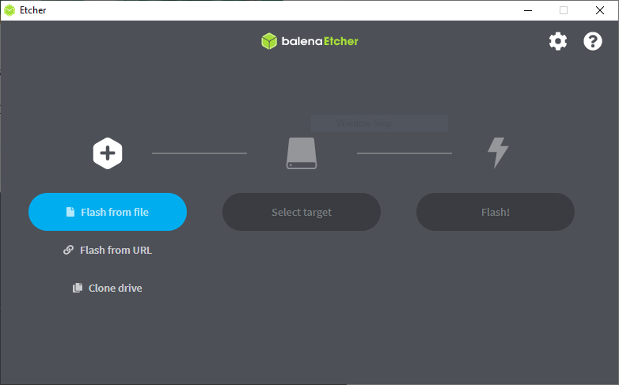
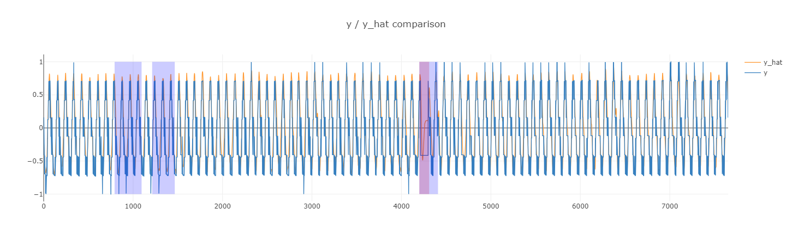
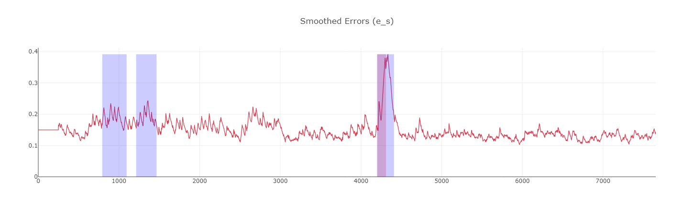

# AIE LSTM-Based Anomaly Detection - AI Engine Versal Integration Using the ADM-VB630/DEV

## Introduction
The objective of this work is to investigate a potential Space-deployable hardware implementation of a representative LSTM-based anomaly detection solution for Spacecraft Telemetry already tested in ground-based data center hardware [[1]](#1).  While GPU and CPU-based computing clusters and data centers, can provide very flexible, easily programmable, high-performance processing for machine learning batch inference and model training, these solutions are often much less suitable for on-orbit deployment where power efficiency, long-term product lifetime, radiation tolerance and low-latency inference are priorities.  This work investigates the deployment of an inference solution in more suitable hardware provided by AMD, namely the Versal Edge VE2302 device, which is available as a flight-qualified radiation-tolerant component, includes the AMD XDNA (AIE-ML) architecture suitable for very power-efficient, low-latency inference implementation, and has an expected device availability of over 15 years.  


## Requirements

| Tool Version | Board         |
|--------------|---------------|
| Vitis 2024.1 | ADM-VB630/DEV |


## Overview

**Section 1**: Project Configuration and Build Flow

**Section 2**: Running the Software Model

**Section 3**: Running on Hardware

**Section 4**: Visualizing the Anomaly Detection - Comparing Software and Hardware Results

**Section 5**: Recompiling the Project

<details>
  <summary>Directory Structure</summary>

  ### Directory Structure

  ```
  anomaly_aie_lstm
  |____doc.............................contains a white paper on the project
  |____helpers.........................contains project configuration file and utility scripts
  |    |___filter_channel_labels.py....script for filter active channels based on the project selected
  |    |___generate_config.py..........script that generates embedded host software header and system.cfg 
  |    |___helpers.py..................script that contains various helper functions 
  |    |___prepare_hw_data.py..........script for preparing the model and input data for hardware
  |    |___prj_config.yaml.............project configuration file
  |    |___result-viewer-hw.ipynb......Jupyter notebook for visualizing hardware-based results
  |    |___result-viewer-sw.ipynb......Jupyter notebook for visualizing software-based results
  |    |___run_hw_model.py.............script for remotely running on hardware and retrieving results
  |____images..........................contains images that appear in the README.md
  |____lstm............................contains AI engine project folders
  |    |___prj_single_model_2buffs.....contains files for the single model two-buffer-based project
  |    |       |aie....................contains all the aie source files
  |    |       |pl_kernels.............contains all the data mover source files
  |    |       |sw.....................contains embedded host application source files
  |    |       |Makefile...............with recipes for each step of the design compilation
  |    |       |system.cfg.............contains system configuration settings
  |    |___prj_par_models_2buffs.......contains files for the multi-graph two-buffer-based project
  |    |       |aie....................contains all the aie source files
  |    |       |pl_kernels.............contains all the data mover source files
  |    |       |sw.....................contains embedded host application source files
  |    |       |Makefile...............with recipes for each step of the design compilation
  |    |       |system.cfg.............contains system configuration settings
  |____platform........................contains Vitis platform generation scripts for the VB630
  |____data.zip........................an archived copy of the telemanom data
  |____Makefile........................with recipes for each step of the design compilation
  |____requirements.txt................specifies the dependencies and their versions required for the project
  ```

</details>


## Section 1: Project Configuration and Build Flow

This project requires Python 3.6+ to run the scripts, in line with the [Telemanom repo](https://github.com/khundman/telemanom). It is recommended to use the full path of your Python3 installation, which should be set using the `PROJECT_PYTHON_PATH` environment variable:

```sh
export PROJECT_PYTHON_PATH=/path/to/python3
```

A prebuilt SD card image (`sd_card.img`) is available for download from [ADM-VB630 Anomaly AIE LSTM Prebuilt](https://support.alpha-data.com/share/outgoing/zft8kxvm-qwpl-19au-9j3d-xeytuzbn7shc/sd_card_vb630_lstm_aie.zip) to help you get started quickly. If you need to rebuild the image, please follow the steps in **Section 5**.

### Configuration

A YAML configuration file (`<package_root>/helpers/prj_config.yaml`) is included in the package and this specifies the example projects, representing different approaches to mapping the models to the AIE-MLs on the ADM-VB630 board. The target project should be specified under 'run_settings' as follows:

```sh
run_settings:
  project: prj_single_model_2buffs
  ...
```

### Build Flow

A Makefile (<package_root>/Makefile) is included in the package to ease the build and run flows. With the environment properly set up, you can run 'make all' to go from creating a virtual environment to building the project.

To be more specific, running 'make all' will run the following targets:
1. venv: Creates a virtual environment and installs required libraries (see <package_root>/requirements.txt).
2. clone_telemanom: Clones the Telemanom repo into the package root and installs the libraries specified in <package_root>/telemanom/requirements.txt.
3. unzip_data: Unzips the test data into the 'telemanom' folder.
4. prepare_hw_data: Converts the model data (from HDF5) and input data (from NPY) to TXT formats, in a form that can be consumed by the graphs on the ADM-VB630.
5. generate_config: Generates the content of system.cfg for XSA linking and models.h header file for the host software.
6. build_project: Builds the project and creates an SD card image (sd_card.img) inside `<package_root>/lstm/<project_name>/sw/`.

Each of the above steps can be run independently by using the respective targets, as relevant flow dependencies have been handled. For instance, running 'make prepare_hw_data' to convert the models will first download and unzip data if that has not yet been done.

### Project Cleanup

To remove the model and input data generated for the active project (as specified in the `<package_root>/helpers/prj_config.yaml` file), run:

```sh
make clean_data
```

To clean the Vitis build artifacts for the active project, run:

```sh
make clean_hw
```

To clean the entire package, run:

```sh
make clean_all
```

**Note**: The command `make clean_all` will remove the Telemanom repository and all generated data, including the Vitis build artifacts for all the projects, returning the package to its original state.


## Section 2: Running the Software Model

The Makefile includes a target (`run_sw`) that invokes the script `<package_root>/helpers/filter_channel_labels.py` to update the labeled anomalies file for the model(s) specified in the project configuration. It then runs the downloaded trained software model(s) on the local CPU, using the corresponding downloaded sequence data as input.

To rerun the experiment described in the Telemanom paper, but only for the channels specified in the project configuration, run:

```sh
make run_sw
```
**Note**: The default configurations in "telemanom/config.yaml" are used.


## Section 3: Running on Hardware

### Board Setup

Using [BalenaEtcher](https://etcher.balena.io/) or similar software, burn the prebuilt SD card image to a microSD card. If you want to rebuild the image, follow the steps in **Section 5**.



Now, set up the board as follows:
 - Install the ADM-VB630 into a VITA46 backplane.
 - Connect the USB-C cable between the ADM-VB630-RTM and the host PC.
 - Insert the microSD card into the VB630. Take care with the delicate mechanism of the card holder.
 - Set SW2[1:8]=01010001 on ADM-VB630 to boot from the microSD card and with VPX IO enabled.
 - Set SW1-5=1 on the VB630 to enable VPX JTAG.
 - Power up the board. Open a serial terminal at 115.2kbps (with XON/OFF control flow deactivated) and connect to the COM port associated with the board. You should see the board booting from the uSD card.

### Running the Hardware Model from the Board's Linux Terminal

After powering up the ADM-VB630 board, it should boot to the Linux prompt. The default username is `petalinux`. On the first boot, you will need to choose a password. To run the example, first switch to a superuser (`sudo su`), and then run the following commands:

```sh
export XILINX_XRT=/usr
dmesg -n 4 && echo "Hide DRM messages..."
cd /run/media/*1
./host.exe a.xclbin
```

After a successful run, copy the generated result(s) from the microSD card to the local folder `<package_root>/lstm/<project_name>/output/` for visualization.

### Running the Hardware Model Remotely Over SSH

The Makefile includes a target (`run_hw`) that invokes the script `<package_root>/helpers/run_hw_model.py` to run on hardware. However, before running the make target, ensure the SD card has been inserted into the board and the board is powered on (refer to **Section 3** for details). Also, ensure the `ssh_hostname`, `ssh_port`, and `ssh_password` are all up-to-date. The `ssh_password` is the password you set on the ADM-VB630 the first time you boot the board. All these settings can be modified under the `run_settings` in the `<package_root>/helpers/prj_config.yaml` file:

```sh
run_settings:
  ...
  ssh_hostname: XX.XX.XX.XX # Change this to the IP address assigned to your ADM-VB630 board
  ssh_port: 22  # Default SSH port
  ssh_username: petalinux # Default used in the prebuilt
  ssh_password: password # Change this to your chosen password
```

The run on hardware, use: 

```sh
make run_hw
```

This command uploads the file `<package_root>/lstm/<project_name>/sw/embedded_exec.sh` to the ADM-VB630 and executes it. It then copies the generated results to the folder `<package_root>/lstm/<project_name>/output/`, ready for visualization.


## Section 4: Visualizing Anomaly Detection - Comparing Software and Hardware Results

It then copies the file `<package_root>/helpers/result-viewer-compare.ipynb` 

Two targets (`visualize_sw` and `visualize_hw`) in the Makefile can be used to visualize the software and hardware results respectively. Invoking either of these will copy the Jupyter notebook (`result_viewer_sw.ipynb` or `result_viewer_hw.ipynb`) to the `<package_root>telemanom/telemanom` folder and run it. Below are examples of the plot of the output sequnence and smoothed errors for the channel 'A-2'.






## Section 5: Recompiling the Project

**IMPORTANT**: Before recompiling the project ensure you have installed Vitis&trade; 2024.1 software. Additionally, make sure you have downloaded the Common Images for Embedded Vitis Platforms from the following link:

https://www.xilinx.com/support/download/index.html/content/xilinx/en/downloadNav/embedded-platforms/2024-1.html

The 'common image' package contains a prebuilt Linux kernel and root file system that can be used with the Versal board for embedded design development using Vitis.

Before starting this tutorial, complete the following steps:

1. Navigate to the directory where you have unzipped the Versal Common Image package.
2. In a Bash shell, run the ```/Common Images Dir/xilinx-versal-common-v2024.1/environment-setup-cortexa72-cortexa53-xilinx-linux``` script. This script sets up the SDKTARGETSYSROOT and CXX variables. If the script is not present, you must run the ```/Common Images Dir/xilinx-versal-common-v2024.1/sdk.sh```.
3. Set up your ROOTFS, and IMAGE to point to the ```rootfs.ext4``` and Image files located in the ```/Common Images Dir/xilinx-versal-common-v2024.1``` directory.
4. Set up your PLATFORM_REPO_PATHS environment variable to ```<package_root>/platform```.

Several project examples have been provided. See the included white paper for details. In summary, the following are the included projects:
1. prj_single_model_2buffs - A single-model single-graph project with model data loaded into two buffers, capable of detecting anomalies in a single channel.
2. prj_par_models_2buffs - A multi-graph version of `prj_single_model_2buffs`, with multiple graphs running in parallel, capable of detecting anomalies in multiple channels simultaneously.

First, specify the target project under 'run_settings' in the `<package_root>/helpers/prj_config.yaml` file:

```sh
run_settings:
  project: prj_single_model_2buffs # or any of the example projects
```

Then, run the following command from the package root to build the project:

```sh
make build_project
```

This make target will invoke the various make targets in the selected AIE project located in the `lstm` folder. These include targets for:

- Compiling the AIE-ML graphs.
- Building the data mover kernels.
- Linking the kernels and the AIE-ML graphs with the base platform and creating an XSA file.
- Compiling the embedded host application (`host.exe`).
- Packaging the SD card image (`sd_card.img`).

After the project is successfully built, follow the steps in **Section 3** to run the model(s) on the ADM-VB630.


## References
<a id="1">[1]</a> 
K. Hundman, V. Constantinou, C. Laporte, I. Colwell and T. Soderstrom (2018). 
Detecting Spacecraft Anomalies Using LSTMs and Nonparametric Dynamic Thresholding. 
The 24th ACM SIGKDD International Conference on Knowledge Discovery and Data Mining, 2018, London.
